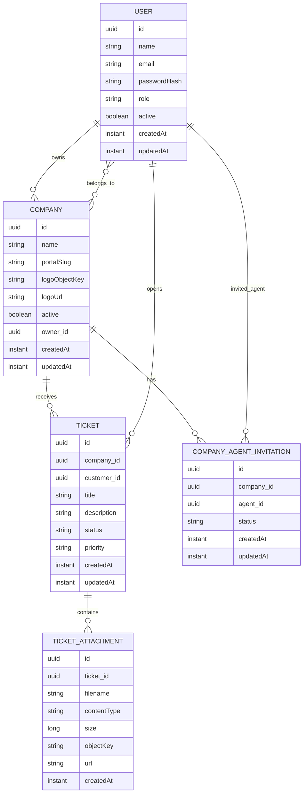

# CloudDesk

CloudDesk e uma API backend para um help desk multiempresa com autenticacao JWT, sessoes com refresh token, armazenamento de arquivos em S3 e controle de acesso por papel.

O projeto foi construido com Spring Boot e hoje cobre os fluxos centrais de:

- cadastro e autenticacao de `OWNER`, `AGENT` e `CUSTOMER`
- gestao de empresas e portal por slug
- convite de agentes para empresas
- abertura e consulta de tickets com anexos
- controle de sessoes ativas e revogacao

## Descricao

O objetivo do CloudDesk e servir como backend para um portal de suporte onde:

- `OWNER` cria e administra empresas
- `AGENT` pertence a uma ou mais empresas e atende os tickets delas
- `CUSTOMER` abre tickets para uma empresa

O acesso e orientado por papel e o backend ja devolve contexto util para o frontend:

- `GET /api/owners/me` retorna o owner e as empresas dele
- `GET /api/agents/me` retorna o agent e as empresas em que ele pertence
- `GET /api/customers/me` retorna os dados do customer autenticado

## Stack

- Java 21
- Spring Boot 4
- Spring MVC
- Spring Security
- Spring Data JPA
- PostgreSQL
- Redis
- AWS SDK v2 S3
- LocalStack para ambiente local
- Springdoc OpenAPI / Swagger UI
- JUnit + Mockito
- JaCoCo com cobertura minima de 100% em linha e branch

## Features

### Autenticacao e sessoes

- login com `POST /api/login`
- access token JWT no corpo da resposta
- refresh token em cookie `HttpOnly`
- rotacao de refresh token
- logout da sessao atual
- listagem de sessoes ativas
- revogacao de outras sessoes

### Usuarios por papel

- criacao publica de owner, agent e customer
- leitura e atualizacao do proprio perfil
- soft delete dos usuarios
- owner e agent recebem as empresas relacionadas no endpoint `/me`

### Empresas

- owner cria empresa com nome e `portalSlug`
- consulta publica por slug para uso no portal
- atualizacao e exclusao logica
- upload e remocao de logo em S3

### Convites de agentes

- owner convida agent por email para uma empresa
- agent lista convites pendentes
- agent aceita ou rejeita convite

### Tickets

- customer cria ticket com `multipart/form-data`
- anexos opcionais multiplos
- tipos permitidos: imagem e PDF
- rollback de upload em caso de falha parcial
- customer lista os proprios tickets
- owner lista e consulta tickets por empresa
- agent lista e consulta tickets por empresa

## Modelagem de dados



## Estrutura do projeto

```text
src/main/java/wiliammelo/clouddesk
|- auth        # login
|- session     # refresh, logout, sessoes ativas
|- security    # JWT, filtro e regras de acesso
|- owner       # perfil do owner
|- agent       # perfil do agent
|- customer    # perfil do customer
|- company     # empresas, logos e convites
|- ticket      # tickets e anexos
|- storage     # integracao com S3
|- shared      # erros e OpenAPI
|- user        # entidade base de usuario
```

## Como rodar localmente

### Pre-requisitos

- Java 21
- Docker e Docker Compose
- opcionalmente `curl` para testar a API

### 1. Suba as dependencias

O projeto esta configurado para usar:

- PostgreSQL em `localhost:5432`
- Redis em `localhost:6379`
- LocalStack em `localhost:4566`

Voce pode subir tudo com:

```bash
docker compose -f compose.yaml up -d
```

O bucket S3 local `clouddesk-company-assets` e criado automaticamente por:

```text
localstack/init/01-create-s3-bucket.sh
```

### 2. Rode a aplicacao

```bash
./mvnw spring-boot:run
```

Por padrao a API sobe em:

```text
http://localhost:8080
```

### 3. Acesse a documentacao

- Swagger UI: `http://localhost:8080/swagger-ui.html`
- OpenAPI JSON: `http://localhost:8080/v3/api-docs`

## Configuracao local

As configuracoes atuais ficam em `src/main/resources/application.yaml`.

Principais valores:

```yaml
spring:
  datasource:
    url: jdbc:postgresql://localhost:5432/clouddesk
    username: clouddesk
    password: clouddesk
  data:
    redis:
      host: localhost
      port: 6379

clouddesk:
  storage:
    s3:
      bucket: clouddesk-company-assets
      region: us-east-1
      endpoint: http://localhost:4566
      access-key: test
      secret-key: test
      public-base-url: http://localhost:4566
      path-style-access-enabled: true
```

## Testes e qualidade

Rodar a suite:

```bash
./mvnw test
```

O build hoje exige:

- 100% de cobertura de linhas
- 100% de cobertura de branches

Isso e validado pelo JaCoCo durante a fase de teste.

## Observacoes de implementacao

- a persistencia principal usa PostgreSQL
- o controle de sessoes usa Redis
- anexos e logos usam S3 compativel, com LocalStack no ambiente local
- o refresh token e enviado em cookie `HttpOnly`